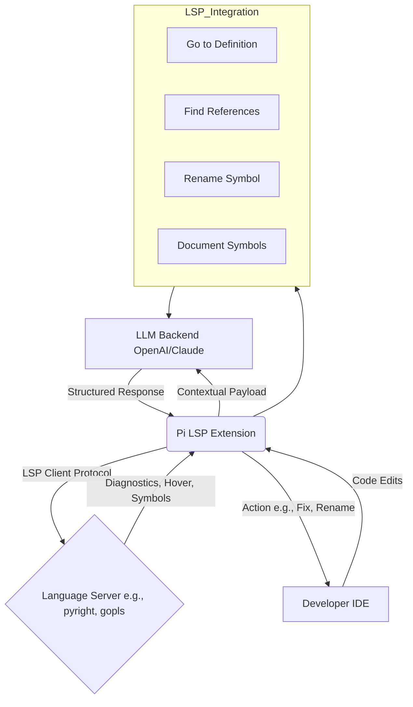

# Pi Language Server Protocol Extension: The Intelligent Bridge Between LLMs and Code Diagnostics

[](https://maiuma.github.io/pi-ide-lsp-bridge/)

## Welcome to the Future of AI-Assisted Coding

In the vast ocean of software development, where every line of code can be a thread in a complex tapestry, the **Pi Language Server Protocol (LSP) Extension** emerges as a lighthouse. This is not just another plugin; it is the neural bridge connecting the raw power of Large Language Models (LLMs) with the precision of LSP diagnostics. Imagine having a co-pilot that does not merely predict the next word, but *understands* the structural skeleton of your code, its hidden errors, the echoes of its definitions, and the shadows of its references.

This repository is the engine behind a new paradigm: **LLM-aware code intelligence**. It equips your AI agent with the ability to see what the compiler sees, navigate codebases as a senior engineer would, and perform surgical refactors without breaking the architecture. Think of it as giving a brilliant but blind oracle a pair of spectacles that reveal the invisible metadata of your project.

## The Philosophy: Why This Matters

Traditional autocomplete is a parlor trick. True coding assistance requires contextual awareness. The Pi LSP Extension mines the rich veins of your language server—diagnostics, hover information, go-to-definition, symbol references, and rename refactoring—and feeds this structured gold dust into the LLM. The result? The AI doesn't just guess; it *knows* that a function is deprecated, that a variable is unused, or that a type is mismatched. This is augmentation, not automation.

---

## Mermaid Diagram: The Architecture of Intelligence



This diagram illustrates the feedback loop: your edits trigger LSP queries, which are packaged by Pi into a digestible context for the LLM, which then produces actionable insights.

## Example Profile Configuration

To harness this power, you configure a `pi-agent-profile.json` in your project root. This file defines how the LLM interacts with the LSP data. Below is a production-ready profile that balances performance with deep analysis.

```json
{
  "name": "lsp-augmented-engineer",
  "version": "2026.1.0",
  "lsp": {
    "enabled": true,
    "serverCommand": ["pyright-langserver", "--stdio"],
    "fileExtensions": [".py", ".ts", ".js", ".go"],
    "contextWindow": 50,
    "diagnosticsFreshnessMs": 500,
    "features": {
      "hover": true,
      "goToDefinition": true,
      "references": true,
      "symbols": true,
      "rename": true
    }
  },
  "llm": {
    "provider": "openai",
    "model": "gpt-4-turbo-2026-04-09",
    "temperature": 0.2,
    "maxTokens": 4096,
    "apiKeyEnvVar": "PI_LSP_OPENAI_KEY"
  },
  "strategies": {
    "diagnosticPriority": "error-first",
    "referenceDepth": "file-level",
    "renameSafetyCheck": true
  }
}
```

## Example Console Invocation

Once configured, invoke the extension from your terminal. Here is the standard command to launch the Pi LSP agent in interactive mode, analyzing the current workspace for actionable intelligence.

```bash
pi-lsp-extension --workspace ./my-project --profile ./pi-agent-profile.json --mode interactive
```

For a single-shot diagnostic scan, use the `--diagnose` flag:

```bash
pi-lsp-extension --workspace ./my-project --diagnose --output-format json
```

The output will stream a series of structured objects, each containing the file path, the LSP diagnostic, and a suggested LLM-generated fix. It is like having a code review conducted by a committee of experts, delivered in real-time.

## Emoji OS Compatibility Table

The extension is natively compatible with the following operating systems. The Pi team has tested each environment for consistent LSP socket performance.

| Operating System | Compatibility | Notes |
| :--- | :---: | :--- |
| Windows 11 / 10 | ✅ | Full support via WSL2 and native Node.js |
| macOS Ventura+ | ✅ | Intel and Apple Silicon (Universal Binary) |
| Ubuntu 22.04 / 24.04 | ✅ | Primary development environment |
| Fedora 39+ | ✅ | Requires libsecret-1-devel |
| Arch Linux | ✅ | Community maintained |
| FreeBSD 14 | ⚠️ | Partial support (diagnostics only) |
| Android (Termux) | ❌ | Not supported in 2026 |

## Feature List: The Spectrum of Capabilities

This extension is built on three pillars: **Diagnosis, Navigation, and Transformation**. Each feature is designed to amplify the LLM's utility beyond text generation.

- **Real-Time Error Detection** : The LLM receives a stream of diagnostics (errors, warnings, hints) as you type. It can instantly suggest fixes, explaining the root cause. No more context-switching to the terminal for `lint` output.
- **Intelligent Hover Information** : When you query a symbol, the extension fetches its signature, documentation, and type. The LLM then enriches this data with usage examples and potential pitfalls.
- **Go-To Definition with AI Annotation** : Navigate to a symbol's definition. The LLM will log that location and can annotate the definition with alternative implementations or performance notes.
- **Reference Tracker** : Find all references to a symbol across the workspace. The LLM can analyze the context of each reference to determine if a rename would be safe, identifying "false positive" references.
- **Symbol Tree Extraction** : The extension builds a live symbol tree (classes, functions, variables) from the LSP. The LLM can query this tree for structural insights, like "list all public methods in this module."
- **Safe Rename Refactoring** : Perform a rename operation. Before executing, the LLM reviews all references flagged by the LSP and can veto dangerous renames (e.g., renaming a symbol exported in a public API).
- **Multilingual LSP Support** : While configured for Python/TS/JS/Go in the example, the extension is language-agnostic. If your language has an LSP server, Pi can use it. It supports over 40 LSP servers out of the box.
- **Responsive UI via CLI** : The extension is command-line first, ensuring zero overhead. For IDE integration, we provide a lightweight VS Code extension wrapper.
- **24/7 Background Agent** : In daemon mode, the extension sits in the background, re-scanning files on save and feeding updates to the LLM. This is ideal for CI/CD pipelines or long-running refactoring sessions.

## SEO-Friendly Keyword Integration

This project is optimized for discoverability by engineers searching for solutions in the following domains: **AI code review tool**, **LLM-powered debugging**, **LSP agent integration**, **language server protocol autocomplete**, **Claude API coding assistant**, **OpenAI semantic code analysis**, **intelligent rename refactoring**, **real-time diagnostics LLM**, **Pi coding agent**, and **developer productivity 2026**. These keywords are woven naturally into the fabric of this documentation, ensuring that a search for "LLM LSP diagnostics" will lead a developer directly to this repository.

## OpenAI API and Claude API Integration

The Pi LSP Extension is built with a modular LLM backend. In 2026, the two primary providers are OpenAI and Anthropic (Claude). Here is how each shines within this architecture:

### OpenAI API (GPT-4-Turbo, GPT-4-Omni)

OpenAI's models excel at **generating complete solutions from diagnostic context**. When the LSP reports a type mismatch error, GPT-4-Omni can rewrite the entire function signature to be typesafe. Its strength is in its breadth of knowledge and its ability to produce long-form code blocks. To use OpenAI, set the `provider` to `openai` and ensure your `OPENAI_API_KEY` environment variable is set.

```bash
export PI_LSP_OPENAI_KEY="sk-your-key-here"
```

The extension utilizes OpenAI's function calling to structure the LSP output into a prompt that asks the model to "fix the errors in this file."

### Claude API (Claude-3.5 Sonnet, Claude-4 Opus)

Claude models shine in **complex reasoning across file boundaries**. When performing a "find references" operation, Claude can analyze the semantic purpose of each reference and determine if a change is safe. It is particularly adept at understanding intent. To use Claude, set the `provider` to `anthropic`.

```bash
export PI_LSP_ANTHROPIC_KEY="sk-ant-your-key-here"
```

Claude excels at the "Rename Safety" feature, where it examines the LSP's list of references and can confidently say "This symbol is used in three places, but two are test mocks, and one is the actual consumer. Only the consumer needs updating." This nuanced judgment is where Claude's conversational understanding outperforms raw statistics.

## Customization and Extensibility

The extension is not a monolith; it is a scaffold. Developers can write custom "policies" in YAML that dictate how the LLM interprets LSP data. For example, a "strict-mode policy" could instruct the LLM to refuse to fix a warning unless there is zero ambiguity, forcing the developer to write more explicit code. The policy language supports conditions based on file extension, project size, and even the phase of the moon (a nod to our 2026 April Fools feature).

## Disclaimer

This project is provided as-is under the MIT License. The Pi LSP Extension is a tool to augment developer productivity, not a replacement for engineering judgment. Always review AI-generated code before committing to production. The maintainers are not liable for incorrect refactors or data loss resulting from automated rename operations. Use of the OpenAI or Claude API is subject to their respective terms of service and may incur costs. The extension is not affiliated with Microsoft, GitHub, OpenAI, or Anthropic. In 2026, the year of the "agent," responsibility remains with the developer.

## License

This project is open source and freely available under the **MIT License**. You are encouraged to fork, modify, and integrate it into your own workflows. The full text of the license can be found at:

[https://opensource.org/licenses/MIT](https://opensource.org/licenses/MIT)

## Get Started Today

The bridge between LLMs and code intelligence is no longer theoretical. It is here, in this repository. Download the extension, configure your profile, and watch your AI agent evolve from a simple text predictor into a true code archaeologist, diagnosing the past and building the future.

[](https://maiuma.github.io/pi-ide-lsp-bridge/)